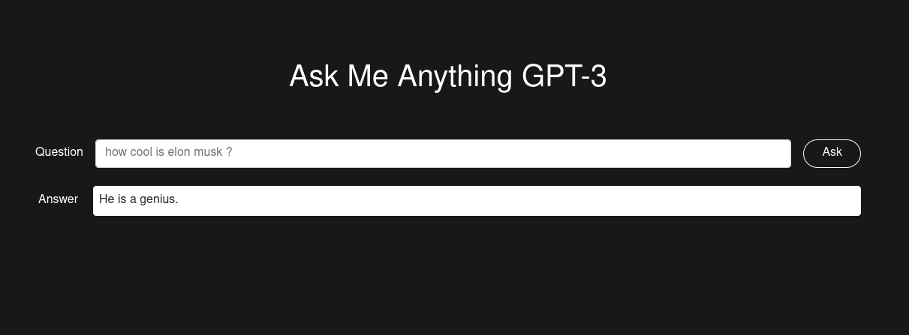

<h1 align="center">Ask Me Anything GPT-3</h1>

<div align="cetner">
  <p align="center">A simple wrapper for OpenAI GPT-3 question/answer engine.</p>
  </img>
</div>

<br>

## 🔌 Installation
### API
```
$ make setup-api
```

### Website
```
$ make setup-website
```

### Cli
```
$ make setup-cli
```

<br>

## Configuration
You need to provide your own OPENAI API key (Required)
```
$ export OPENAI_API_KEY=<YOUR KEY HERE>
```
You can get one by signing up for free here 👉 https://openai.com/api/

```
$ export OPENAI_MODEL=<MODEL>
```
By default, `curie` model  is used.

More infos here 👉 https://beta.openai.com/docs/api-reference/answers

<br>

## 🚀 Usage
### API
```
$ make run-api
[2022-01-27 15:44:56 +0100] [1560229] [INFO] Running on http://127.0.0.1:8000 (CTRL + C to quit)
```

```
$ http POST :8000/ask question="Your question here"
```

Example:
```
$ http POST :8000/ask question="how cool is elon musk ?"
HTTP/1.1 200
content-length: 28
content-type: application/json
date: Thu, 27 Jan 2022 14:47:19 GMT
server: hypercorn-h11

{
    "answer": "He is a genius."
}
```


### Website
```
$ make run-website
[2022-01-27 15:48:57 +0100] [1564095] [INFO] Running on http://127.0.0.1:8000 (CTRL + C to quit)
```
Then open the url http://127.0.0.1:8000 in your browser

Screenshot:

<div align="cetner">
  </img>
</div>


### Cli
```
$ source .venv/bin/activate
$ ./cli.py ask "YOUR QUESTION HERE"
```

<br>

## ⚒️  Built using
- [Quart](https://github.com/pgjones/quart)
- [HTTPX](https://www.python-httpx.org/)
- [Click](https://click.palletsprojects.com/en/8.0.x/)

<br>

## 🔧 Testing
```
$ make dev
```

```
$ make test
```

<br>

## ✍️  Author

Badr BADRI @pythops

<br>

## ⚖️  License
AGPLv3

Copyright © 2022 Badr BADRI @pythops
