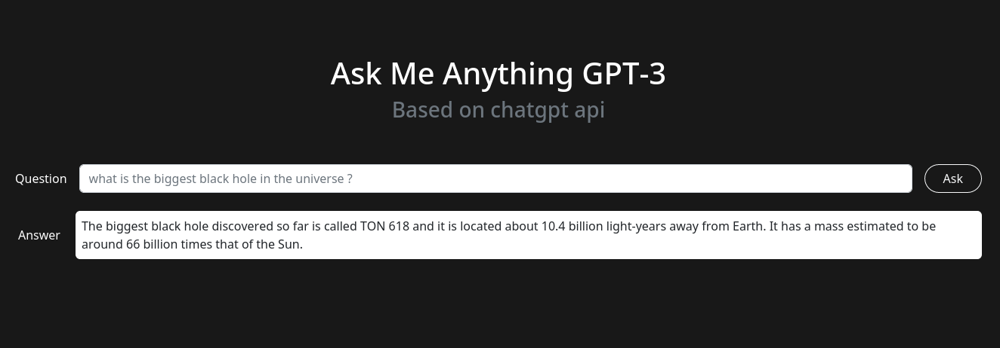

<h1 align="center">Ask Me Anything GPT-3</h1>

<div align="cetner">
  <p align="center">A simple wrapper for OpenAI chatgpt</p>
  </img>
</div>

<br>

## 💫 Demo

Here is a free and publicly available instance that you can play with

**https://amagpt3.com**

**Note**:
I put some limitations to avoid explode my budget.
the question and the answer has a max of **200 characters**

<br>

## Support

If you enjoy **amagpt3** and you want to support it, you can buy me a coffe

<a href="https://www.buymeacoffee.com/pythops" target="_blank"></a>

## 🔨 Requirements

You'll need to have [just](https://github.com/casey/just) installed in your system.

## 🔌 Installation

### Requirements for running amagpt3 in an OCI container (Optional)

You'll need :

- [podman](https://github.com/containers/podman)
- [buildah](https://github.com/containers/buildah)

### API

```
$ just setup-api
```

Or, if you want to build the OCI image:

```
$ just build-api
```

### Website

```
$ just setup-website
```

Or, if you want to build the OCI image:

```
$ just build-website
```

### Cli

```
$ just setup-cli
```

### Slack Bot

```
$ just setup-slack
```

Or, if you want to build the OCI image:

```
$ just build-slack
```

<br>

## Configuration

You need to provide your own OPENAI API key (Required)

```
$ export OPENAI_API_KEY=<YOUR KEY HERE>
```

You can get one by signing up for free here 👉 https://openai.com/api/

```
$ export OPENAI_MODEL=<MODEL>
```

<br>

For Slack bot, you need to provide the following tokens:

```
$ export SLACK_APP_TOKEN=xoxb-xxx
$ export SLACK_BOT_TOKEN=xapp-xxx
```

More infos here 👉 https://api.slack.com/bot-users

<br>

## 🚀 Usage

### API

```
$ just run-api
[2023-03-18 13:26:30 +0100] [1870524] [INFO] Running on http://127.0.0.1:8000 (CTRL + C to quit)
```

Or, run the api inside the container

```
$ just deploy-api
```

Then use any http client (i'm using httpie in the example below) to interact with API

```
$ http POST :8000/ask question="Your question here"
```

Example:

```
$ http POST :8000/ask question="What is the biggest black hole in the universe ?"
HTTP/1.1 200
content-length: 289
content-type: application/json
date: Sat, 18 Mar 2023 12:29:11 GMT
ratelimit-limit: 1
ratelimit-remaining: 1
ratelimit-reset: 0
server: hypercorn-h11

{
    "answer": "The biggest black hole discovered so far is called TON 618 and it is located about 10.4 billion light-years away from Earth. It has a mass estimated to be around 66 billion times that of the Sun. However, there may be even larger black holes that have not yet been discovered."
}
```

### Website

```
$ just run-website
[2023-03-18 13:29:59 +0100] [1874551] [INFO] Running on http://127.0.0.1:8000 (CTRL + C to quit)
```

Or, run the website inside the container

```
$ just deploy-website
```

Then open the url http://127.0.0.1:8000 in your browser

Screenshot:

<div align="cetner">
  </img>
</div>

### Cli

```
$ source .venv/bin/activate
$ ./cli.py ask "YOUR QUESTION HERE"
```

### Slack

```
$ just run-slack
```

Or, run the slack bot inside the container

```
$just deploy-slack
```

<br>

## ⚒️ Built using

- [Quart](https://github.com/pallets/quart)
- [HTTPX](https://github.com/encode/httpx/)
- [Click](https://github.com/pallets/click/)

<br>

## 🔧 Testing

```
$ just dev
```

```
$ just test
```

<br>

## ✍️ Author

Badr BADRI @pythops

<br>

## ⚖️ License

AGPLv3

Copyright © 2022-2023 Badr BADRI @pythops

<br>

## ℹ️ OpenAI Policies

Anyone who is willing to copy this code and launch their own Q&A app, must follow OpenAI going live policy 👉 https://beta.openai.com/docs/going-live
